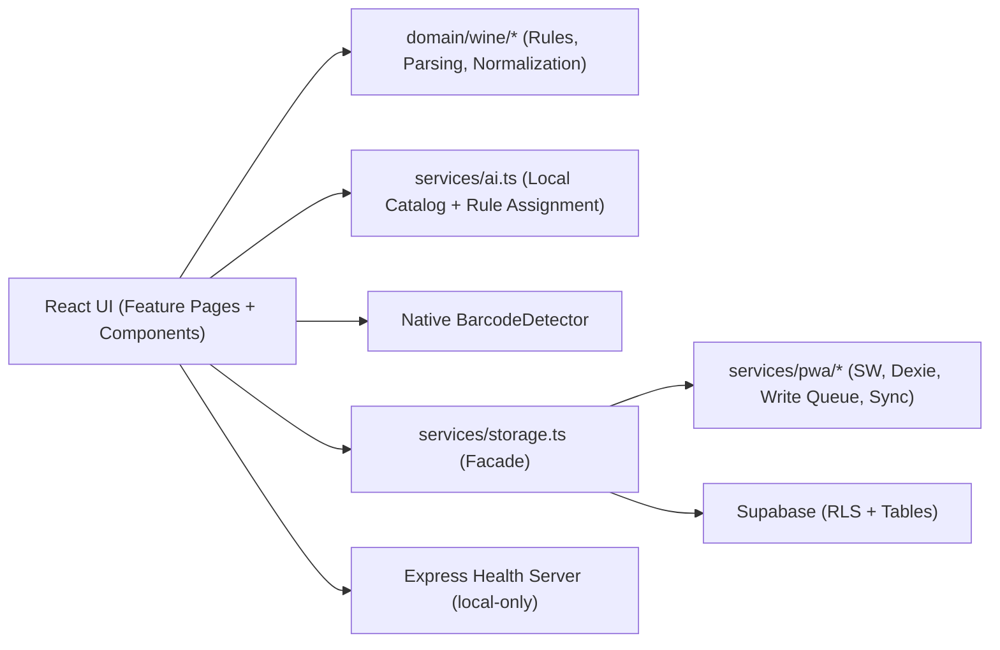

# Architektur IST (Stand 2026-02-13)

## Systemübersicht

## Umgesetzte Refactor-Bausteine

1. Toolchain/Gates

- Lokales Tailwind (`tailwind.config.cjs`, `postcss.config.cjs`, `index.css`)
- ESLint + Prettier + Vitest konfiguriert
- Einheitliches Gate: `npm run ci:check`

2. Frontend-Struktur

- Feature-Einstiegspunkte sind auf Ordnerstruktur umgestellt:
  - `features/inventory/InventoryPage.tsx`
  - `features/wine-detail/WineDetailPage.tsx`
  - `features/enjoyment-plan/EnjoymentPlanPage.tsx`
- Legacy-Dateien bleiben als kompatible Thin-Wrapper (`features/Inventory.tsx`, `features/WineDetail.tsx`, `features/EnjoymentPlan.tsx`).

3. Domain-Extraktion

- Drinkability nach `domain/wine/drinkability.ts`
- JSON-Parser nach `domain/wine/jsonParsers.ts`
- Import/Normalisierung nach `domain/wine/normalization.ts`
- `utils.ts` bietet Backward-Compat Re-Exports.

4. Storage-Aufteilung

- Fachliche Repositories unter `services/storage/*.ts`
- Kompatible Fassade bleibt unverändert über `services/storage.ts`

5. Lokaler Betrieb ohne externe KI-API

- `services/ai.ts` beschränkt Recherche auf den lokalen Weinkatalog.
- Anlasszuordnungen werden deterministisch aus lokal berechneten Kandidaten-Scores gewählt.
- Der Scanner nutzt ausschließlich die native `BarcodeDetector`-API; Bilder werden nicht übertragen.
- `server/src/app.js` stellt nur Health-/Basis-Middleware bereit und keine `/api/ai/*`-Routen.

6. PWA/Offline-Layer

- Vite PWA via `vite-plugin-pwa` (`injectManifest`) in `vite.config.ts`.
- Service Worker: `services/pwa/sw.ts` (Precache + Runtime-Caching + Offline-Fallback).
- Lokaler Persistenzlayer via Dexie:
  - `services/pwa/offlineDb.ts`
  - Queue-/Sync-Typen: `services/pwa/types.ts`
- Offline-first Storage-Adapter:
  - `services/pwa/storageOfflineAdapter.ts`
  - Delegation in `services/storage/index.ts`
- Sync-/Queue-Engine:
  - `services/pwa/syncEngine.ts`
  - `services/pwa/conflictResolver.ts`
- Install-/Update-UX:
  - `services/pwa/installPrompt.ts`
  - `services/pwa/swRegistration.ts`
  - Integration in `index.tsx` und `features/Settings.tsx`.

## Qualitätsstatus

1. `npm run ci:check` ist grün.
2. Build ohne `>500kB` Warnung (Lazy Routes + `manualChunks`).
3. Unit-Tests decken Drinkability, JSON-Parser, Normalisierung, lokale Recherche und Server-Grundpfade ab.
4. Zusätzliche PWA-Unit-Tests decken Dexie, Queue, Konfliktauflösung und Install-Prompt ab.
5. PWA-Smokes vorhanden in:

- `tests/pwa.offline.spec.ts`
- `tests/pwa.sync.spec.ts`

## Bekannte Restarbeit

1. Die drei großen Frontend-Feature-Pages sind zwar in Feature-Ordnern, intern aber noch weiter aufteilbar (Ziel: kleinere Komponenten/Hooks/Mappers).
2. `server/src/ai/runtime.js` kann als nächster Schritt weiter in kleinere Services zerlegt werden (Search/Assignment/Vision getrennt).
3. Sync-Konfliktauflösung ist als `Last Write Wins` implementiert; optionaler manueller Konfliktdialog ist noch nicht vorhanden.
