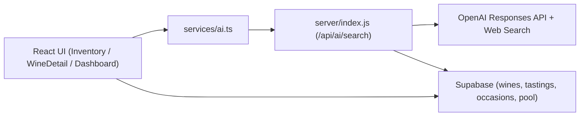

# Architektur IST (Stand Week 1)

## Systemübersicht

## Kritische Flows
1. KI-Recherche:
   - `Inventory.handleAiSearch`
   - Ergebnis -> `aiPreview`
   - Persistenz via `storageService.saveWine`
2. KI-Sync in Weindetail:
   - `WineDetail.handleAiLookup`
   - `mapAiToWinePatch`
   - Persistenz via `storageService.saveWine`
3. Darstellung:
   - Header/Kurzbeschreibung
   - Professionelle Fakten
   - Ratings

## Aktuelle Schmerzpunkte
1. Feldübernahme teils unvollständig bei variierenden JSON-Strukturen.
2. Unterschiedliche Quellen für dieselbe Information (Top-Level vs `details.*`).
3. Kritikerwerte teilweise nur in `details.ratings.critics`, nicht immer in `scores`.
4. UI-Regressionen entstehen bei Layout-Änderungen ohne visuelle Baselines.

## Technische Risiken
1. Prompt-/Schema-Drift zwischen `services/ai.ts`, `server/index.js` und UI-Mapping.
2. RLS/Auth-Kontext kann lokale Analyse-Skripte blockieren.
3. Browser-spezifische Rendering-Abweichungen (Text Clamp/Card Layout).

## Week-2 Fokus aus Architektur-Sicht
1. Zentraler Mapping-Layer mit Feld-Prioritäten.
2. Einheitliche Normalisierung für Typen, Formate, Kritiker.
3. Feldweise Provenienz (Quelle + Zeitstempel) im Datenmodell.
